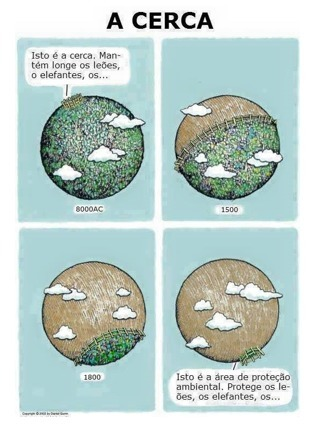
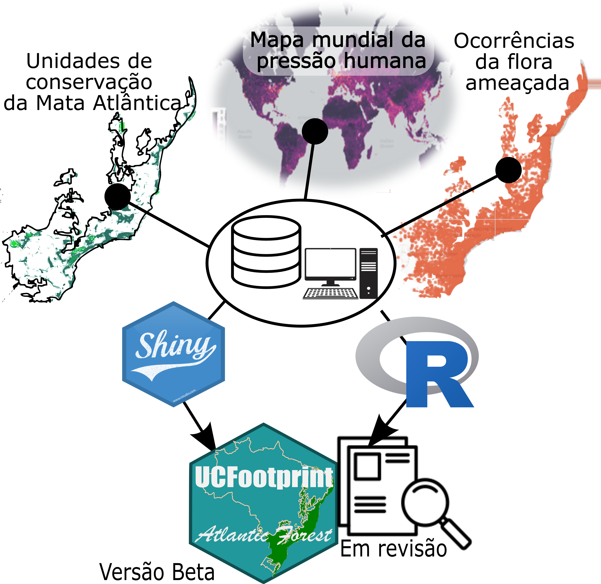
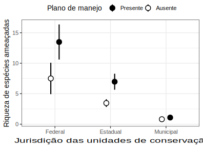
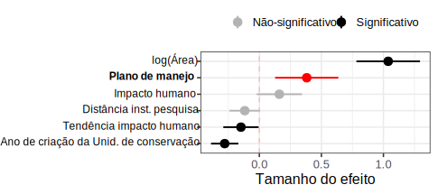
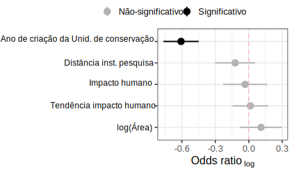
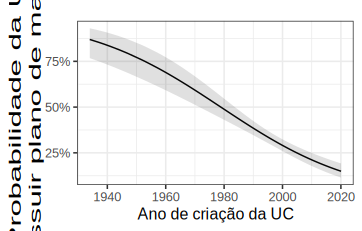
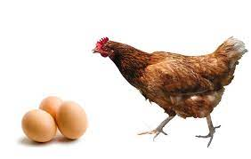
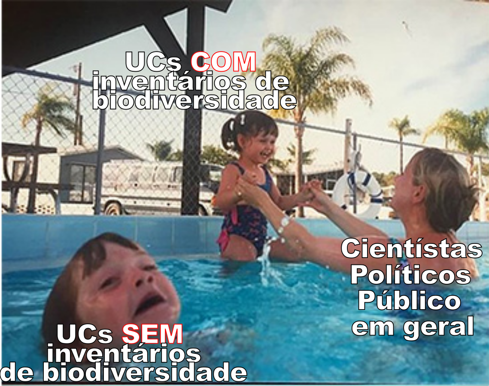

```{r message=FALSE, warning=FALSE, include=FALSE}
library(ggplot2)
library(tidyverse)
```


```{r, echo=FALSE, out.width="60%", fig.align = 'center'}



#Comando que funciona. Fora do Chuck code
#background-image: url(https://pt-static.z-dn.net/files/dc0/2dac76530b8720985d16c348cf6455ce.png)

```


---

# Unidades de conservação (UCs) 
--

Uma forma de proteção da biodiversidade e serviços ecossistêmicos

--

Meta da **Convenção da Biodiversidade (CDB)** para 2030: 
- = 30% da superficie terrestre e marinha<sup>1</sup>
- Atualmente aprox. 270 mil UCs no Mundo<sup>1</sup>
- 1551 UCs na Mata Atlântica<sup>2</sup>

<font size="1"> 
.pull-right[
.pull-right[
.footnote[
[1] https://www.protectedplanet.net/en.

[2] Carol Loss _em prep._
]]]
</font> 

---

# Unidades de conservação (UCs) 

Meta da **Convenção da Biodiversidade (CDB)** para 2030: 
- = 30% da superficie terrestre e marinha<sup>1</sup>
- Atualmente aprox. 270 mil UCs no Mundo<sup>1</sup>
- 1551 UCs na Mata Atlântica<sup>2</sup>

```{r echo=FALSE, message=FALSE, warning=FALSE, fig.height=4, dev='svg'}
DadosUCs<-structure(list(Year = 1990:2021, Terrestre = c(10421720L, 10690997L, 
10953300L, 11515673L, 11857678L, 12251551L, 12859538L, 13222097L, 
13563975L, 13944045L, 14859268L, 15535290L, 16280423L, 16657553L, 
17078161L, 17507281L, 18097124L, 18603564L, 19555267L, 20030748L, 
20246021L, 20459278L, 20716469L, 21048755L, 21237634L, 21500105L, 
21722736L, 21927184L, 22110506L, 22332517L, 22454521L, 22454710L
), Marinho = c(1788639L, 1836570L, 1876973L, 1891841L, 1913379L, 
1956095L, 1977213L, 2001941L, 2034089L, 2067754L, 2104125L, 2296995L, 
2406245L, 2439311L, 2557635L, 2658893L, 4571858L, 5748867L, 5829580L, 
7559697L, 9014531L, 9076928L, 10951201L, 11194508L, 12611495L, 
13678949L, 16240150L, 21960605L, 26330389L, 27480898L, 28054196L, 
28054196L)), class = "data.frame", row.names = c(NA, -32L))


percent_land<-16.64
percent_marine<-7.74
  
Total_land<-max(DadosUCs$Terrestre)/(percent_land/100)
Total_marine<-max(DadosUCs$Marinho)/(percent_marine/100)


DadosUCs%>%
  pivot_longer(!Year,names_to="Type",values_to="Values")%>%
  mutate(Values=Values/1000000)%>%
    ggplot(.,aes(x=Year,y=Values,group=Type))+
  geom_point(aes(color=Type),size=1)+
  geom_line(aes(color=Type),linetype=1,size=1)+
  theme_minimal(base_size=16)+
  labs(y="Área Milhões/Km²",x="Ano",color=NULL,subtitle="Série histórica das UCs no mundo x metas AICHI/2020")+
  scale_y_continuous(breaks = seq(0, 50, by = 10),limits=c(0,50))+
  scale_x_continuous(breaks = seq(1990, 2020, by = 10),limits=c(1990,2022))+
  theme(aspect.ratio=0.5)+
  geom_hline(yintercept=.17*Total_land/1000000,col="lightgreen",linetype=2,size=1)+
 geom_hline(yintercept=.10*Total_marine/1000000,col="skyblue",linetype=4,size=1)+
  scale_color_manual(values=c("dodgerblue4","darkgreen"))
```

<font size="1"> 
.pull-right[
.pull-right[
.footnote[
[1] https://www.protectedplanet.net/en.

[2] Carol Loss _em prep._
]]]
</font> 
---

# Mudança de paradigma: 

## Qualidade > Quantidade! 

--

- Eficiência é difícil de ser mensuarada

--

  - Falta de padronização

--

- Plano de manejo!

--

 - Ausente na maioria das vezes 😢


---

### UCs que recebem mais atenção são mais eficientes em proteger a flora brasileira? 

--

#### **Premissa**: a presença do *plano de manejo* é um indicador da atenção que as UCs recebem e reflete a qualidade de proteção oferecida às espécies ameaçadas.
--

##### **H1**: UCs com plano de manejo devem apresentar maior número de espécies ameaçadas

---

```{r, echo=FALSE, out.width="75%", fig.align = 'center', fig.cap="Fluxo de trabalho"}

```

<font size="1"> 
.pull-right[
.pull-right[
.footnote[
[1] Carol Loss _em prep._
[2] [Venter et al. 2016: Scientific Data](https://www.nature.com/articles/sdata201667) 
[3] [Livro Vermelho da Flora](https://dspace.jbrj.gov.br/jspui/handle/doc/26) 
]]]
</font> 

---

### **Dados disponíveis: visão geral**: 

--

- 863 de 1551 UCs na Mata Atlântica

- 32% UCs com plano de manejo

- 10,407 registros de espécies ameaçadas

- 1,395 espécies 

- 33% UCs com registros de espécies ameaçadas 

---

### **Resultado 1:** O número de espécies é, em média 2x maior em UCs com plano de manejo. 

```{r, echo=FALSE, out.width="75%", fig.align = 'center', fig.cap=""}

```

---

### **Resultado 2:** Plano de manejo é um importante preditor para o número de espécies ameaçadas conhecidas

- Mesmo quando outras variáveis são consideradas, o plano de mano de manejo continua sendo uma variável de grande importância para estimar o nº de espécies ameaçadas 

--

```{r, echo=FALSE, out.width="150%", fig.align = 'center', title=NULL}

```

---

### **Resultado 3:** Mas o que determina a presença do plano de manejo?

--

- Aparentemente apenas a idade de criação da UC parece determinar a presença do plano de manejo.

--

```{r, echo=FALSE, out.width="80%", fig.align = 'center', fig.cap=""}

```

---

### **Resultado 3:** Mas o que determina a presença do plano de manejo?

- Aparentemente apenas a idade de criação da UC parece determinar a presença do plano de manejo.

```{r, echo=FALSE, out.width="80%", fig.align = 'center', fig.cap=""}

```

---

## Plano de manejo gera um viés nos inventários da biodiversidade? Possíveis causas:

--

- Planos de manejo são muitas vezes dependentes de dados secundarios.

- Pesquisadores e tomadores de decisão tendem a priorizar o que sabem que é importante
 - Inclusive para conseguir financiamento de pesquisa.

--

```{r eval=FALSE, fig.align='center', fig.cap="", include=FALSE, out.width="50%"}

```

---

```{r, echo=FALSE, out.width="100%", fig.align = 'center', title=""}

```

---

### **Produto 1:** 

#### Principais achados:

--

- UCs com plano de manejo têm maior número de espécies ameaçadas;

 - A presença do plano de manejo é um importante preditor do número de espécies ameaçadas conhecidas;

- Plano de manejo parecem estar sendo orientados pela lista de espécies ameaçadas. 

---

### **Produto 2:** 

```{r, echo=FALSE, out.width="100%", fig.align = 'center', fig.cap=""}
knitr::include_graphics("Figures/Panorama.png")
```

---


<iframe src="https://ecosantos.shinyapps.io/Footprint"style="border: 0; position:absolute; top:5%; left:0; right:0; bottom:0; width:100%; height:95%"">
</iframe>


---

### **Produção**
##### Plano de trabalho
- 1 Artigo em revisão
- 1 App (versão Beta)

##### Extra
- 2 Pré-prints
- 5 artigos (Aceitos ✔️ & revisão 👀)
 - ✔️ *Biota Neotropica* 
 - ✔️ *Scientific Data*        
 - 👀 *PeerJ*                           
 - 👀 *Forest Ecology & Management*
 - 👀 **2x** *Boletim Museu Bio. Mello Leitão*
- Capítulo de livro: **BPBES** Plataforma Brasileira de Biodiversidade e Serviços ecossistêmicos (*em fase final de revisão*)

- Árvores de Vix: https://ecosantos.github.io/ArvoresVix/

- Ecopopr: https://ecopopr.shinyapps.io/Ecopop_Interativa/


---
class: inverse, center, middle, animated, bounceInDown

# Obrigado 😃

 Dani Moreira | Carol Loss | Mario Garbin
  
---
class: center, middle, animated, bounceInDown
count: false

# Aplicativos

 Árvores de Vitória | Ecopop Interativa
  
---
count: false

##### Árvores de Vitória

https://ecosantos.github.io/ArvoresVix/

<iframe src="https://ecosantos.github.io/ArvoresVix/"style="border: 0; position:absolute; top:5%; left:0; right:0; bottom:0; width:100%; height:80%"">
</iframe>

---
count: false

##### Ecopop Interativa

<iframe src="https://ecopopr.shinyapps.io/Ecopop_Interativa/"style="border: 0; position:absolute; top:5%; left:0; right:0; bottom:0; width:100%; height:80%"">
</iframe>


```{r eval=FALSE, include=FALSE}
#EXPORTA A APRESENTAÇÃO PARA O FORMATO PDF
#Rodar separamente este comando
pagedown::chrome_print("index.html")
```  
  
  